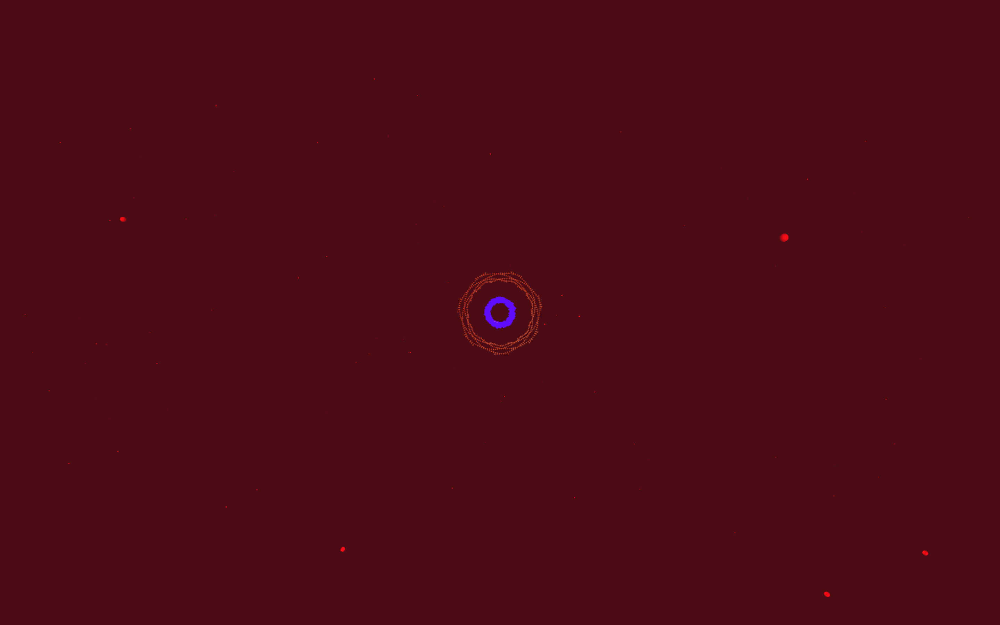
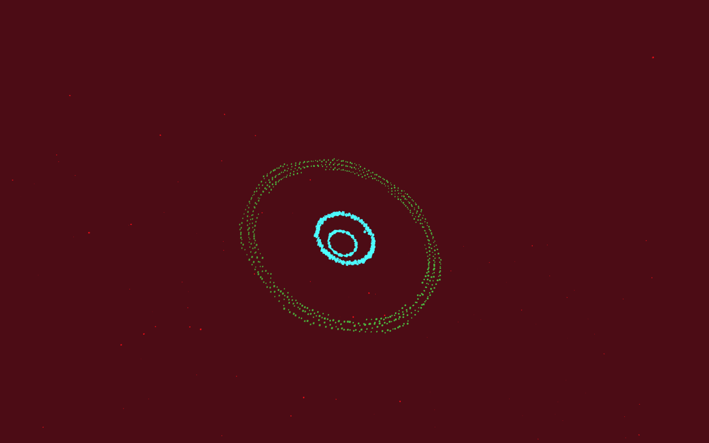
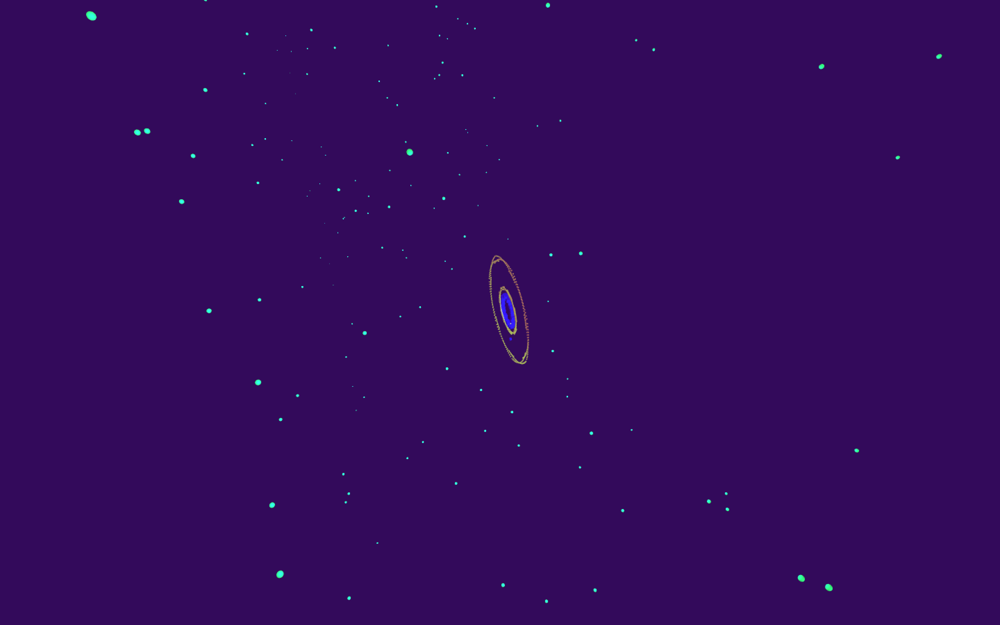
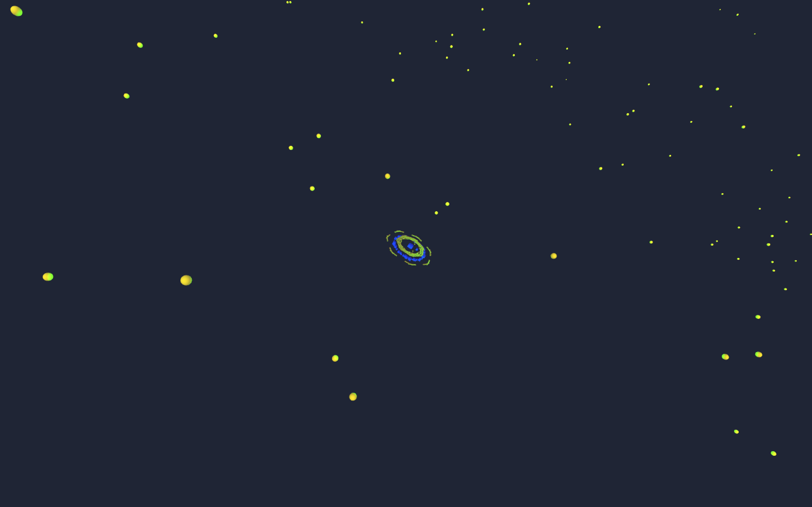

# Music Visualization using Processing

A music visualization project using Processing 3

## Getting Started

### Prerequisites

Download Processing 3 at  http://processing.org/download

Sample audio file is included (Logic-Take-it-back), but you can use any song of your choice in the data folder and rename it "your-song.mp3", or change line 55 of lorenz.pde to match the name.
* </img>
* </img>
* </img>
* </img>
* </img>
